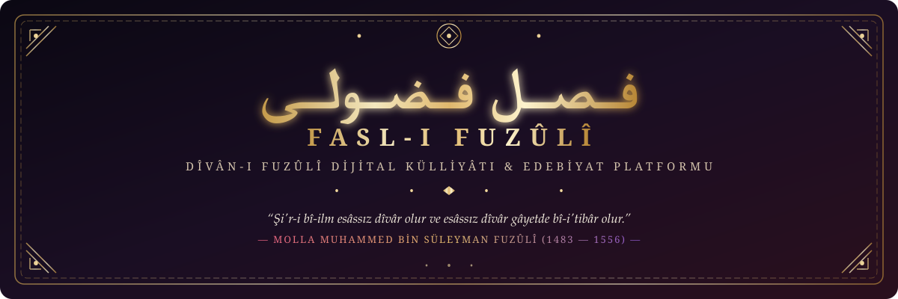

<p align="center">
  
</p>

<p align="center">
  
</p>

<p align="center">
  
  
  
  
  
  
  
  
</p>

---

> ### *"Şi'r-i bî-ilm esâssız dîvâr olur ve esâssız dîvâr gâyetde bî-i'tibâr olur."*  
> — **Molla Fuzûlî (Türkçe Dîvân Dîbâcesi)**

---

## 🌟 Fasl-ı Fuzûlî Külliyâtı ve Edebiyat Motoru v4.0

**Fasl-ı Fuzûlî**, klasik Türk ve Şark edebiyatının en büyük lirik dehası **Molla Muhammed bin Süleyman Fuzûlî**'nin (1483-1556) eserlerini, aşk felsefesini, poetikasını, vezin ve kafiye yapısını ve tasavvufi remizlerini dijital çağa taşıyan kapsamlı bir açık kaynak edebiyat ve yazılım platformudur.

### ✨ Öne Çıkan Başlıca Özellikler (v4.0)
- 📜 **Genişletilmiş Külliyât Veri Tabanı:** 14 Başyapıt Gazel, **32 beytin tamamı** ile Su Kasîdesi, Mesnevîler (*Leylâ vü Mecnûn*, *Beng ü Bâde*), Mensur eserler (*Şikâyetnâme*, *Hadîkatü's-Süedâ*, *Rind ü Zâhid*, *Dîbâce*) ve Hikemî Kıt'a/Rübâiler.
- 🎨 **Kapsamlı Edebî Sanat ve Belâgat Motoru:** Beyitlerdeki 12 klasik edebî sanatı (Tezat, Tenasüp, Hüsn-i Ta'lîl, Teşbih, Teşhis, Tecâhül-i Ârif, İştikak, Mübalağa, İstifham, Nidâ, Tecrid, Rücû') anında tespit edip şerh eden analizör (`fuzuli sanat`).
- ⚖️ **Aruz Vezni & Taktî' Motoru:** 16 klasik aruz kalıbı; mısraları açık (.) ve kapalı (-) hecelerine ayırıp tef'ilelerine göre görsel takti' eden bölümleme motoru (`fuzuli takti`).
- 🎶 **Kafiye ve Redif Tahlil Motoru:** İki mısra arasındaki sözcük ve ek rediflerini, revî harfini ve kafiye türünü (Yarım, Tam, Zengin Kafiye) otomatik çözümleyen algoritma (`fuzuli kafiye`).
- ✨ **Musammat Gazel (İç Kafiye) Tahlilörü:** Mısra ortalarında iç kafiye barındıran beyitleri tespit eden tahlil motoru (`fuzuli musammat`).
- 🔗 **Nazîre ve Akraba Beyitler Eşleştiricisi:** Verilen bir mısra veya vezne vezin ve kafiyece nazire/akraba olabilecek beyitleri eşleştiren motor (`fuzuli nazire`).
- 🎨 **Hat & Tezhip Estetiğinde Beyit Kartı Üretici:** Seçilen beyitleri altın yaldızlı tezhip çerçevesi ve sülüs/talik tipografisiyle Canvas üzerinde render edip yüksek çözünürlüklü PNG indirme imkanı.
- 🎶 **Mistik Ney & Sükûn Modu (Web Audio API):** Harici dosya gerektirmeksizin tarayıcıda neva/rast makamı derin irfan fonu üreten Web Audio synthesizer.
- 📖 **Dîvân Lügati & Mazmunlar Rehberi:** 100'ü aşkın maddeyle tasavvufi remizler, arkaik kelimeler ve belâgat ıstılahları.
- 📜 **Tarihî Şu'arâ Tezkireleri:** Ahdî (*Gülşen-i Şu'arâ*), Âşık Çelebi (*Meşâ'irü'ş-Şu'arâ*), Latîfî, Kınalızâde Hasan Çelebi ve Sehî Bey'in Fuzûlî hakkındaki birincil tarihî şerhleri.
- 🎯 **Genişletilmiş Bilgi Yarışması:** 25 soruluk zengin bankadan 5 rastgele soru, puanlama ve açıklamalı şerhler (`fuzuli yarisma`).
- 🧪 **Kapsamlı Test Süiti:** 43 adet otomatik birim testi ile %100 doğruluk ve CI/CD entegrasyonu.

---

## 🏛️ Fuzûlî Hakkında Söylenenler (Tezkireler ve Münekkitler)

> *"Fuzûlî, Türk edebiyatının ve bütün Doğu âleminin gelmiş geçmiş en büyük aşk ve ıstırap şairidir. Fakat onun bahsettiği ıstırap insanı küçülten veya ezen bir keder değil; insan ruhunu kâinat derecesinde büyüten, onu saflaştırıp mutlak hakikate yükselten ilahi bir ateştir. Türkçe onun nefesinde musikinin ve samimiyetin zirvesine ulaşmıştır."*  
> — **Ahmet Hamdi Tanpınar (*19. Asır Türk Edebiyatı Tarihi*)**

> *"Fuzûlî yalnız Türk edebiyatının değil, bütün İslâm ve Şark edebiyatlarının en büyük lirik dehalarından biridir. Üç dilde (Türkçe, Farsça, Arapça) dîvân tertip etmiş ve her birinde sahasının en yüksek zirvesine bayrak dikmiştir."*  
> — **Prof. Dr. Mehmet Fuad Köprülü (*Fuzûlî Hayatı ve Eserleri*)**

> *"Gör zümre-i nâzımân-ı Rûm'u / Fâik mi değil Fuzûlî ma'lûm... Söz söylemek ol güher-feşândan / Kalmış bize mülk-i Bağdâd'dan!"*  
> — **Ziyâ Paşa (*Harâbât Mukaddimesi*)**

---

## 💎 Fuzûlî Külliyâtından Seçkin İnciler

### 🔥 1. Aşk, Cân ve Canân Üzerine Başyapıt Gazel Beyitleri

> **Beni cândan usandırdı cefâdan yâr usanmaz mı**  
> **Felekler yandı âhımdan murâdım şem'i yanmaz mı**  
> ↳ *Sevgili bana eziyet ederek canımdan bezdirdi; kendisi cefa etmekten usanmaz mı? Âhımın alevinden gökler tutuştu da bir tek muradımın mumu yanmaz mı?*

> **Cânı kim cânânı içün sevse cânânın sever**  
> **Cânı içün kim ki cânânın sever cânın sever**  
> ↳ *Kim ki canını sırf cananı (sevgilisi) için severse, aslında o sevgilisini sevmektedir. Fakat kim sevgilisini kendi canının menfaati için severse, o sadece kendi nefsini ve canını sevmektedir!*

> **Aşk derdiyle hoşem el çek ilâcımdan tabîb**  
> **Kılma dermân kim helâkim zehri dermândadır**  
> ↳ *Ben bu aşk derdinden son derece memnunum, ey tabip bana ilaç vermekten el çek! Bana derman sunma ki, benim helak olmam asıl o dermanın zehrindedir (aşkımın bitmesindedir).*

> **Mende Mecnûn'dan füzûn âşıklık isti'dâdı var**  
> **Âşık-ı sâdık menem Mecnûn'un ancak adı var**  
> ↳ *Bende Mecnûn'dan kat kat fazla âşıklık kabiliyeti vardır; gerçek ve vefalı âşık benim, Mecnûn'un ise sadece adı çıkmıştır!*

> **Öyle sermestem ki idrâk etmezem dünyâ nedür**  
> **Ben kimem sâkî olan kimdür mey ü sahbâ nedür**  
> ↳ *Öyle sarhoş ve kendimden geçmişim ki dünyanın ne olduğunu anlamıyorum; ben kimim, kadehi sunan sâkî kimdir, şarap ve kadeh nedir bilmem!*

---

<p align="center">
  
</p>

### 🌊 2. Şaheser: Su Kasîdesi'nden Na't-ı Şerif İncileri (32 Beyit Tam Metin)

> **Sâçma ey göz eşkden gönlümdeki odlara su**  
> **Kim bu denlü tutuşan odlara kılmaz fâide su**  
> ↳ *Ey gözüm! Gönlümdeki aşk yangınlarına gözyaşından su saçma; çünkü bu derece alevlenip tutuşmuş yangınlara su fayda vermez!*

> **Hâk-i pâyine yetem dir ömrlerdir muttasıl**  
> **Başını daşdan daşa urup gezer âvâre su**  
> ↳ *Su, senin ayağının toprağına ulaşayım diyerek asırlardır durmaksızın başını taştan taşa vurarak avare bir halde akıp gezmektedir.*

> **Dest-bûsi ârzûsiyle ger ölsem dostlar**  
> **Kûze eylen toprağım sunun anunla yâra su**  
> ↳ *Ey dostlar! Eğer onun elini öpme arzusu ve hasretiyle ölürsem; mezarımın toprağından bir testi (kûze) yapın ve o testiyle o sevgiliye su sunun!*

---

<p align="center">
  
</p>

### 🏜️ 3. Leylâ vü Mecnûn Mesnevîsi'nden Edebi Doruklar

> **Yâ Rab belâ-yı aşk ile kıl âşinâ beni**  
> **Bir dem belâ-yı aşkdan etme cüdâ beni**  
> ↳ *(Mecnûn'un Kâbe'deki Münâcâtı)*: *Ey Rabbim! Beni aşk belasına aşina eyle, beni bir an bile aşk derdinden ayrı düşürme! Bana olan aşk derdini artır, sevgilimin güzelliğini çoğalt, benim de o derde tahammülümü ve vefamı sonsuz eyle!*

---

<p align="center">
  
</p>

### 📜 4. Şikâyetnâme'den Sosyal Hiciv

> *"Selâm verdim rüşvet değildür deyu almadılar. Hüküm gösterdim fâidesüzdür deyu mültefit olmadılar. Eğerçi zâhirde sûret-i itâ'at gösterdiler, ammâ zebân-ı hâl ile cemî'-i su'âlime cevâb-ı bârid verdiler..."*

---

## 🗂️ Külliyât Proje Mimarisi

```
fasl-i-fuzuli/
│
├── biyografi-ve-tahlil/           # Şâirin Hayatı, Sanatı, Şiir Felsefesi ve Kaynakça
│   ├── hayati-ve-sanati.md        # Ayrıntılı biyografi, edebi dönemi, Bağdat ve Kerbelâ muhiti
│   ├── ilim-ve-siir-felsefesi.md  # Fuzûlî'nin poetikası: Şiir ve İlim dengesi
│   └── kaynakca.md                # Tenkitli basımlar (Gölpınarlı, Tarlan, İpekten vb.)
│
├── eserler/                       # Metinler, Transkripsiyon, Aruz, Şerh ve Tahliller
│   ├── divan/                     # Türkçe Dîvân ve Seçkin Şiirler
│   │   ├── dibace.md              # Türkçe Dîvân Mukaddimesi (Asıl Metin + Çeviri + İnceleme)
│   │   ├── gazeller/              # Başyapıt Gazeller (Beyit Beyit Şerh ve Sanatlar)
│   │   ├── kasideler/
│   │   │   └── su-kasidesi.md     # 32 Beyit Tam Metin Na't-ı Şerif, Vezin ve Şerh
│   │   └── rubailer-ve-kitalar/
│   │       └── secme-rubailer.md  # Hikemî ve Tasavvufî Rübâi/Kıt'a Seçkisi
│   ├── mesneviler/
│   │   ├── leyla-vu-mecnun.md     # Doğu Edebiyatının En Lirik Mesnevisi Tahlili
│   │   └── beng-u-bade.md         # Şarap ve Afyon Münazarası (Alegorik Hiciv)
│   └── mensur-ve-mektup/
│       ├── sikayetname.md         # Şikâyetnâme Tam Metin ve İnceleme
│       ├── hadikatus-sueda.md     # Kerbelâ Makteli Şaheseri
│       └── rind-u-zahid.md        # Rind ile Zâhid Münazarası
│
├── lugat-ve-mazmunlar/            # Istılahlar, Mazmunlar ve Belâgat
│   ├── fuzuli-sozlugu.md          # Divan Istılahları ve Tasavvufi Kavramlar Sözlüğü
│   ├── mazmunlar-ve-remizler.md   # Gül-Bülbül, Şem'-Pervâne, Ok-Gamze Mazmunları
│   └── aruz-ve-edebi-sanatlar.md  # Vezin Kalıpları ve Kullanılan Edebi Sanatlar
│
├── web/                           # 🌐 Modern İnteraktif Web Uygulaması
│   ├── index.html                 # Tek Sayfa Uygulama (SPA)
│   ├── style.css                  # Divan Hat & Altın Varak Temalı CSS
│   └── app.js                     # Canlı Arama, Aruz Analizörü, Quiz ve Fâl Motoru
│
├── araclar/                       # 🐍 Python CLI, API & Poetik Analiz Motoru
│   ├── __init__.py
│   ├── corpus.json                # Genişletilmiş Yapılandırılmış JSON Veri Tabanı
│   ├── api.py                     # Aruz Motoru, Arama, İstatistik ve Export API
│   └── fuzuli_cli.py              # Zenginleştirilmiş Terminal Komut Satırı Arayüzü
│
├── tests/                         # 🧪 Kapsamlı Otomatik Test Süiti (43 Birim Testi)
│   ├── test_corpus.py             # API ve Veri Bütünlüğü Testleri
│   ├── test_aruz.py               # Heceleme ve Aruz Vezni Testleri
│   ├── test_poetics.py            # Taktî', Kafiye/Redif, 12 Edebî Sanat ve Musammat Testleri
│   ├── test_quiz.py               # Bilgi Yarışması Soru Bankası Testleri
│   └── test_cli.py                # Uçtan Uca CLI Testleri
│
├── .github/workflows/ci.yml       # ⚙️ GitHub Actions Otomatik CI/CD Test Pipeline
├── pyproject.toml                 # Modern Python Paketleme Standardı (PEP 517/621)
├── setup.py                       # Kurulum ve Entrypoint Tanımları
└── requirements.txt               # Bağımlılıklar
```

---

## ⚡ Hızlı Başlangıç & CLI Komutları

```bash
# 1. Depoyu klonlayın
git clone https://github.com/arch-yunus/fasl-i-fuzuli.git
cd fasl-i-fuzuli

# 2. Paketi geliştirici modunda kurun (İsteğe bağlı)
pip install -e .

# 3. Fâl-i Fuzûlî çekin (Rastgele hikmetli beyit ve şerhi)
python -m araclar.fuzuli_cli fal
# veya sistem genelinde:
fuzuli fal

# 4. Gazelleri listeleyin veya seçilen gazeli inceleyin (14 Başyapıt)
python -m araclar.fuzuli_cli gazel
python -m araclar.fuzuli_cli gazel 1
python -m araclar.fuzuli_cli gazel gozum-canim-efendim

# 5. Su Kasîdesi'nden beyit okuyun (veya tüm 32 beyti listeleyin)
python -m araclar.fuzuli_cli su-kasidesi 31
python -m araclar.fuzuli_cli su-kasidesi tum

# 6. Eserleri (Mesnevi veya Mensur) okuyun
python -m araclar.fuzuli_cli eser sikayetname
python -m araclar.fuzuli_cli eser leyla-vu-mecnun

# 7. Aruz Vezni & Taktî' Motoru (16 Kalıp)
python -m araclar.fuzuli_cli aruz "Beni cândan usandırdı cefâdan yâr usanmaz mı"
python -m araclar.fuzuli_cli takti "Beni cândan usandırdı cefâdan yâr usanmaz mı"

# 8. Kafiye ve Redif Tahlili
python -m araclar.fuzuli_cli kafiye "Beni cândan usandırdı cefâdan yâr usanmaz mı / Felekler yandı âhımdan murâdım şem'i yanmaz mı"

# 9. Musammat Gazel (İç Kafiye) Tahlilörü
python -m araclar.fuzuli_cli musammat "Şeb-i hicrân yanar cânım döker kan çeşm-i giryânım"

# 10. Nazîre ve Akraba Beyitler Eşleştiricisi
python -m araclar.fuzuli_cli nazire "Fâ'ilâtün / Fâ'ilâtün / Fâ'ilâtün / Fâ'ilün"

# 11. Edebî Sanat Tahlili (Tezat, Tenasüp, Hüsn-i Ta'lil, Teşbih, vb.)
python -m araclar.fuzuli_cli sanat "Hâk-i pâyine yetem dir ömrlerdir muttasıl / Başını daşdan daşa urup gezer âvâre su"

# 12. Tarihî Şu'arâ Tezkireleri Kayıtları
python -m araclar.fuzuli_cli tezkire ahdi

# 13. Estetik Beyit Kartı Üretici (Terminal & Sosyal Medya)
python -m araclar.fuzuli_cli kart

# 14. Yerel Web Sunucusunu Başlatma
python -m araclar.fuzuli_cli sunucu --port 8000

# 15. Fuzûlî Edebiyat Bilgi Yarışması (25 Soruluk Banka)
python -m araclar.fuzuli_cli yarisma

# 16. Külliyât İstatistiklerini görüntüleyin
python -m araclar.fuzuli_cli istatistik

# 17. Külliyatta canlı arama yapın veya lügatten kavram sorgulayın
python -m araclar.fuzuli_cli ara mecnun
python -m araclar.fuzuli_cli lugat Rind

# 18. İnteraktif Kabuk (REPL) modunu başlatın
python -m araclar.fuzuli_cli interaktif

# 19. Külliyatı Markdown veya JSON olarak dışa aktarın
python -m araclar.fuzuli_cli export markdown > kulliyat_export.md
```

---

## 🌐 İnteraktif Web Arayüzünü Kullanma

Külliyatın modern web arayüzünü doğrudan CLI üzerinden veya tarayıcıda açarak kullanabilirsiniz:

```bash
# Doğrudan gömülü sunucu ile çalıştırma (Önerilen)
python -m araclar.fuzuli_cli sunucu --port 8000

# veya doğrudan statik HTML dosyasını açma:
# Windows
start web/index.html

# macOS
open web/index.html

# Linux
xdg-open web/index.html
```

---

## 🐍 Python API ile Programatik Kullanım

```python
from araclar.api import FuzuliCorpus

corpus = FuzuliCorpus()

# 1. Fâl-i Fuzûlî Çek
fal = corpus.fal_cek()
print(f"Metin : {fal['metin']}")
print(f"Anlamı: {fal['sadelesmis']}")

# 2. Aruz Taktî' Analizi
takti = corpus.takti_et("Beni cândan usandırdı cefâdan yâr usanmaz mı")
print(f"Taktî': {takti['takti_metni']}")
for c in takti['cuzler']:
    print(f"  {c['tefile']}: {c['metin']} ({' '.join(c['semboller'])})")

# 3. Kafiye ve Redif Tahlili
kr = corpus.kafiye_redif_analiz(
    "Beni cândan usandırdı cefâdan yâr usanmaz mı",
    "Felekler yandı âhımdan murâdım şem'i yanmaz mı"
)
print(f"Redif: {kr['redif']} | Kafiye: {kr['kafiye']} ({kr['kafiye_turu']})")

# 4. Edebî Sanat Teşhisi
sanat = corpus.edebi_sanat_analiz("Kamu bîmârına cânân devâ-yı derd eder ihsân / Niçin kılmaz bana dermân beni bîmâr sanmaz mı")
for s in sanat['sanatlar']:
    print(f"  • {s['sanat']}: {s['kelimeler']}")

# 5. Tarihî Tezkire Kaydı
tezkireler = corpus.tezkire_getir("ahdi")
print(tezkireler[0]['metin'])
```

---

## 🧪 Testlerin Çalıştırılması

Tüm 34 test birimini koşturmak için:

```bash
pytest
# veya
python -m unittest discover -s tests -v
```

---

## 🤝 Katkıda Bulunma

Edebi metinlerin zenginleştirilmesi, yeni gazel şerhlerinin eklenmesi, aruz vezinlerinin tespiti veya yazılım araçlarının geliştirilmesi yönündeki katkılar memnuniyetle kabul edilir. Ayrıntılar için lütfen [CONTRIBUTING.md](CONTRIBUTING.md) belgesini inceleyiniz.

---

## 📄 Lisans

Bu proje **MIT Lisansı** altında korunmaktadır. Ayrıntılı bilgi için [LICENSE](LICENSE) dosyasına bakabilirsiniz.
